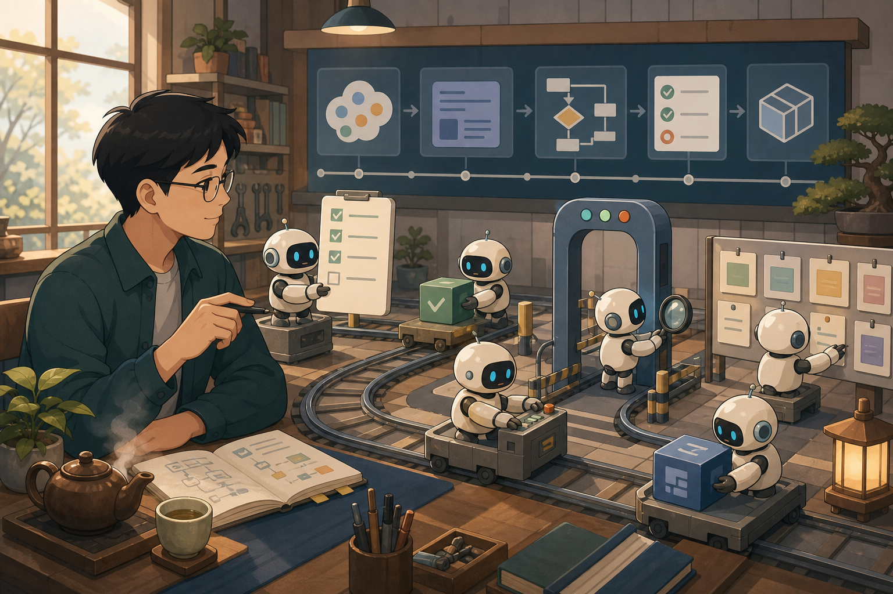
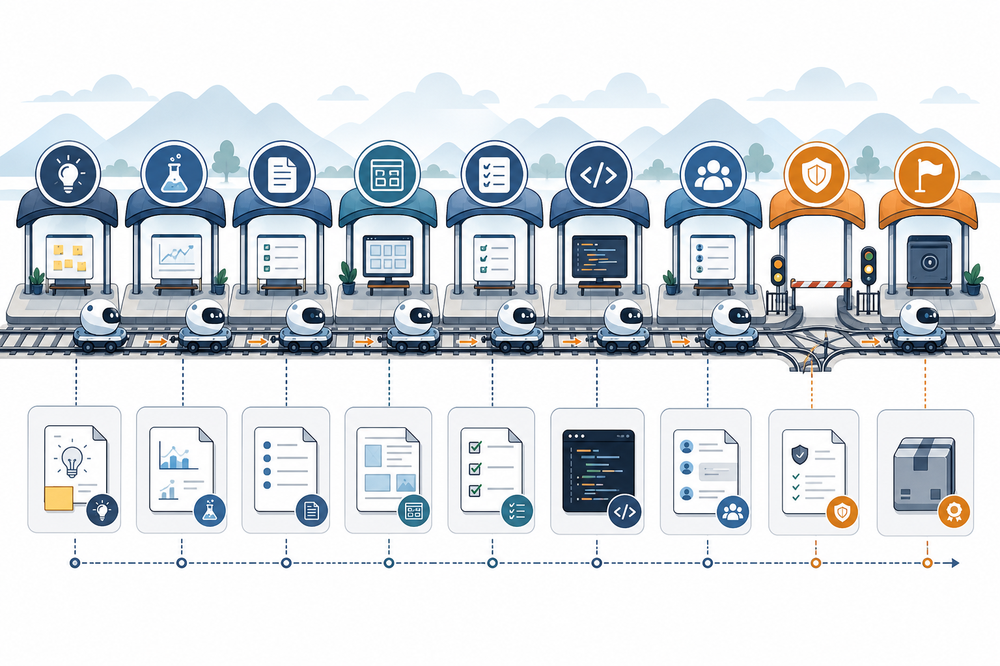
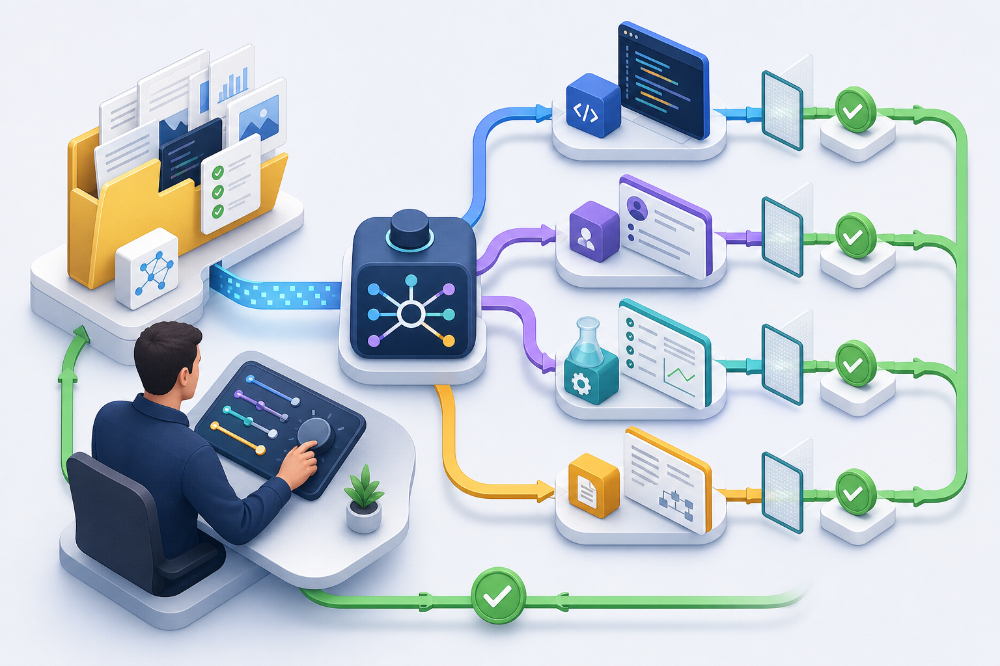

前阵子我一直在读这个工程里的 HarnessFlow。

说实话，刚看到一堆 `hf-*` skill 的时候，我第一反应是：又来一套流程？

程序员最怕什么？不是没有流程，是流程太多。需求流程一套，架构流程一套，测试流程一套，评审流程一套。每套看起来都对，真干活的时候就像背着一书包说明书去爬山，还没上坡，人先累了。

但把 `packs/coding` 下面的东西从头顺了一遍之后，我发现 Harness 这事没那么玄。

它不是为了让 AI 更会聊天。

它是为了让 AI 别乱跑。

太长不想看，那就先看结果：`packs/coding/README.md` 里这套 HarnessFlow，把 product discovery、experiment、spec、design、tasks、TDD、review、gate、finalize 串成了 24 个可分发 skill。它干的事很朴素：把老软件工程里的那些纪律，翻译成 AI Agent 能执行、能留下证据、能被下一轮接住的工作流。

配图由 GPT IMAGE 2 生成：Harness 更像一间可控工作室，不是一句神奇 prompt。

# 1. 先说清楚：Harness 到底是什么

如果只用一句话讲：

**Harness 是给 AI 干活用的工程环境。**

别急着把它理解成框架、平台、脚手架，甚至某个工具名。这里讲的 Harness，更像一整套工作现场：规则、角色、文件、检查点、反馈回路、质量门禁。

咱们以前写代码，最怕“拍脑袋”。

需求没写清楚就开干，开干之后又发现架构不对，架构改完测试没补，测试补完文档忘了同步。一个项目崩掉，往往不止某一行代码写错，更像整个工程现场没人看着。

AI Coding 之后，这个问题被放大了。

以前人会慢慢把项目搞乱。现在 AI 可以很快把项目搞乱。

这话听起来有点损，但真是这么回事。AI 写单个函数、单个文件，能力已经很强了。可软件工程不是“把代码写出来”这么简单。软件工程是“在时间里维护一个系统”。它需要方向、边界、验证和交接。

Prompt Engineering 解决的是“这一句话怎么说得更清楚”。

Context Engineering 解决的是“这一轮对话该喂哪些上下文”。

Harness Engineering 解决的是“整个工作环境该怎么设计，才能让 AI 一轮一轮稳定交付”。

这三件事不是互相替代的关系。Prompt 还是要写好，Context 还是要选准。但到了复杂工程任务，光靠这两件事就不够了。

你不能只给 AI 一句“帮我做个产品”，然后期待它像资深工程师一样自己补齐需求澄清、技术方案、任务拆解、测试策略、代码评审和上线检查。

那不是用 AI。

那是许愿。

# 2. 为什么 AI 越强，Harness 越重要

这个问题一开始也让我有点别扭。

按理说，模型越来越强，流程是不是应该越来越少？AI 都会自己规划了，我还搞这么多 skill、gate、review，是不是多此一举？

后来我想明白了：模型越强，越需要 Harness。

原因很简单，强模型的破坏半径也更大。

一个普通补全工具，最多补错几行。一个能改全仓库的 Agent，如果没有边界，它可以一口气改十几个文件，还会很自信地告诉你“已完成”。等你回头一测，发现需求偏了、接口变了、文档没改、旧功能还挂了……

这种体验，咱们应该都不陌生。

问题不在于 AI 不努力。它太努力了。你让它推进，它就推进；你让它修，它就修；你让它“顺手优化一下”，它可能真的顺手把半个系统重构了。

人类工程师还会犹豫一下：“这个改动影响面是不是太大？” AI 的默认状态更像一个精力过剩的实习生，手快、嘴甜、还特别自信。

Harness 要做的，就是给这股执行力装上轨道。

这不是压制 AI，是给它一个能发挥的场地。

这就像拍照。相机再好，也不能替你决定站在哪里、画面里留什么、什么东西应该拿掉。好设备放大的是你的审美；好 AI 放大的也是你的工程判断。判断力没准备好，放大的可能就是混乱。

# 3. HarnessFlow 是怎么把这件事落地的

读这个仓库里的 Harness 内容，最值得看的不是某一个 skill 写了多少规则，而是整条链路怎么被拆开。

`packs/coding` 里有 24 个 skill。表面看是一堆名字：`hf-specify`、`hf-design`、`hf-tasks`、`hf-test-driven-dev`、`hf-code-review`、`hf-completion-gate`……

但它们不是随便堆出来的。

它们围绕一条工程主线展开：

从“我要做什么”，到“我准备怎么做”，再到“我真的做对了吗”。

配图由 GPT IMAGE 2 生成：HarnessFlow 把 AI 工作拆成一站一站可检查的工程链路。

## 3.1 先别写代码，先搞清楚要什么

链路最前面是 product discovery 和 experiment。

这一步很容易被跳过。尤其是 AI Coding 太快了，脑子里刚冒出一个想法，手已经打开 Cursor 了，嘴里已经在说“帮我实现一个……”

然后 AI 十分钟给你搭出一个东西。

看起来很爽，过几天就开始还债。

HarnessFlow 这里的设计很克制：如果问题还在 thesis、wedge、probe 层面，就先别急着写正式 spec。先用 `hf-product-discovery` 收敛方向；有低置信度假设，就用 `hf-experiment` 做最小验证。

这其实是产品工程里的老道理：不确定的问题，先验证；已经验证的问题，再规格化。

AI 时代这条更重要。因为 AI 让“错误方向的执行”变得太便宜了。便宜到你会忍不住先做，做完再发现不是自己想要的。

便宜的执行力，如果没有昂贵的判断力，最后还是贵。

## 3.2 spec 不是文档洁癖，是方向盘

到了 `hf-specify`，HarnessFlow 开始把模糊需求变成规格。

这里用到的都是老朋友：EARS 句式、BDD/Gherkin、MoSCoW 优先级、ISO 25010 质量属性、Success Metrics。

听起来挺学院派，对吧？

但别被名字吓住。它们解决的是非常具体的问题：需求要可验证，优先级要有边界，质量要求不能只写“性能要好”“体验要顺”这种废话。

对 AI 来说，spec 的价值更直接。

它不是写给老板看的文档，也不是为了显得流程正规。它是后面所有 Agent 的共同坐标系。没有这个坐标系，设计不知道该服务什么，任务不知道该拆到哪里，测试不知道该证明什么，评审也不知道该拿什么当标准。

这就是规格驱动开发（Spec-Driven Development）的朴素版本：先把“对”定义清楚，再让 AI 去追求“快”。

## 3.3 design 不是画架构图，是提前做取舍

`hf-design` 和条件触发的 `hf-ui-design`，解决的是“怎么做”。

这里也不是让 AI 画几张漂亮的架构图就完事。HarnessFlow 把 ADR、C4、ARC42、DDD、Event Storming、STRIDE 这些方法装进 design 阶段，说白了是在逼你提前回答几个问题：

哪些边界不能乱跨？

哪些接口要稳定？

哪些风险现在就得处理，哪些可以先记成 debt？

UI 如果存在，信息架构、状态矩阵、响应式、可访问性是不是也得一起想？

人类工程师写设计文档，经常写着写着就变成“给自己看的解释”。AI 读设计文档时，最需要的是约束，解释反倒排后面：依赖方向、模块边界、接口契约、失败模式。

说白了，design 在 Harness 里不是装门面。

它是给后面的实现阶段立规矩。

## 3.4 tasks 把大雾切成小块

`hf-tasks` 负责把设计拆成任务计划。

这个阶段看起来最普通，实际很关键。AI 最容易在“大任务”里迷路。你给它一个“完成用户系统”，它可能一路从数据库改到前端，再顺手重写鉴权。它不是故意乱来，它只是没有任务边界。

任务拆解就是把雾切开。

HarnessFlow 里这一步用 WBS、INVEST、依赖图、DoD。老东西，土办法，但好用。

任务要小到能测试，独立到能评审，完成标准要能落证据。否则后面的 TDD、review、gate 都会变成空转。

## 3.5 TDD 阶段，AI 终于可以放心跑了

`hf-test-driven-dev` 是唯一实现入口。

我挺喜欢这个设计。“唯一”这两个字很重要。它意味着写代码不是谁想写就写，也不是某个 review skill 顺手修一下，更不是 router 一边判断路线一边动手改代码。

实现就是实现。

它有自己的前提：唯一活跃任务、已批准计划、能读到 progress、spec、design，必要时还得有 worktree 隔离。

它也有自己的纪律：测试设计先确认，再 Red → Green → Refactor。红灯证据必须是真的红，绿灯证据必须是当前会话跑出来的绿。重构时还要守 Two Hats：写行为的时候别顺手清理，清理结构的时候别偷偷改行为。

这套东西看起来麻烦，但它是在保护你。

AI 最大的问题不是不会写，而是太会写。没有 TDD，它会把“看起来完成了”包装得特别像“真的完成了”。有了 TDD，至少每一步都得留下证据。

## 3.6 review 和 gate，不让自己审自己

实现之后，HarnessFlow 不是直接宣布胜利。

它还有一组 review skill：spec review、design review、tasks review、test review、code review、traceability review。再往后是 regression gate、doc freshness gate、completion gate，最后才是 finalize。

这就是老软件工程里最朴素的一条纪律：作者和审查者分开。

让同一个 AI 自己写、自己审、自己宣布完成，风险很高。它会解释自己的选择，会替自己找理由，会把“不确定”说成“已验证”。人也会这样，AI 只是更流畅。

所以 HarnessFlow 要把 review 作为独立节点，甚至要求父会话不要内联 review，而是派发独立 reviewer subagent。

这不是形式主义。

这是把“换一双眼睛看问题”这件事，写进流程里。

# 4. Router 才是这套系统的方向盘

如果说上面那些 leaf skill 是一个个工位，那 `hf-workflow-router` 就是调度室。

它负责决定当前该进哪个节点、用什么 Workflow Profile、采用 interactive 还是 auto、是否需要 worktree、是否要切 hotfix 或 increment 支线。

这里有个很关键的设计：router 基于磁盘工件证据做判断，而不是靠聊天记忆。

聊天记忆很脆。今天这个会话知道你做到哪了，明天新开一个会话就不一定了。人还可以靠脑子接上，AI 很容易靠猜。

HarnessFlow 不让它猜。

它读 `progress.md`，读 spec、design、tasks，读 review 和 verification artifacts。证据冲突时，按未批准处理，选择更上游节点，必要时升级 profile。

配图由 GPT IMAGE 2 生成：Router 不靠聊天印象，靠文件工件判断下一步。

这套设计背后的味道很工程。

状态不能只存在脑子里。状态要落盘。

落盘以后，下一轮 Agent 才能接住；review 才能追溯；gate 才能判断；finalize 才不会变成“我感觉差不多了”。

Garage 在这里还加了一个自己的东西：F014 Workflow Recall。router 在做 profile 决策前，可以查询过去类似 cycle 走过什么路径，给出 historical advisory。

注意，是 advisory only。

历史经验可以提醒你，但不能替代当前证据。这个分寸我觉得很对。否则“以前这么干过”很容易变成新的拍脑袋。

# 5. 用一句土话讲：Harness 就是给 AI 立规矩

读完这套东西，我最大的感受是：HarnessFlow 并没有发明什么神秘新方法。

它很诚实。

需求工程还是需求工程，架构设计还是架构设计，TDD 还是 TDD，Code Review 还是 Code Review，Definition of Done 还是 Definition of Done。

变化在于，以前这些纪律是长在人脑子里的。资深工程师会自然地问：“需求确认了吗？”“这个设计影响哪个模块？”“测试先写了吗？”“这次改动有没有更新文档？”“能不能回归？”

AI 不会天然这么问。

所以你得把这些问题写成流程，写成 skill，写成 gate，写成证据格式。

这就是 Harness 的价值。

目标不是把 AI 训练得更像人，是把人类工程师已经验证过的纪律，变成 AI 可以执行的环境。

换句话说，Harness 不是新魔法。

Harness 是老规矩的新容器。

# 6. 真正难的是“自己的 Harness”

看到这里，可能会有一个自然的问题：那我是不是直接拿 HarnessFlow 用就行了？

可以，但别指望它替你完成所有判断。

这个仓库里的 HarnessFlow 是一套很好的工程骨架。它把通用的软件工程链路拆得很清楚，尤其适合严肃工程任务。但任何 Harness 最后都得长出自己的味道。

你的项目风险在哪里？

你的团队最容易在哪一步偷懒？

你的代码库最怕什么类型的改动？

你的产品更怕方向跑偏，还是更怕质量失控？

这些答案，不在模型里，也不在通用模板里。它们来自你自己的项目经验。

所以我更愿意把 HarnessFlow 看成一个起点，不是终点。它给了咱们一套基本骨架：入口、路由、规格、设计、任务、实现、评审、门禁、收尾。真正长期有价值的，是咱们在这个骨架上不断沉淀自己的判断。

比如某个项目总是在权限边界上出问题，那就把权限 review 做重一点。

某个团队总是文档不同步，那就把 doc freshness gate 变成硬门槛。

某类 bug 反复出现，那就用 `hf-bug-patterns` 把它提炼成 pattern catalog。

这才是 Harness 最有意思的地方：它不是一次配置完就结束，而是会随着项目一起长。

# 7. 我会怎么开始用它

如果让我从零开始用 HarnessFlow，我不会一上来就全量跑 24 个 skill。

那太重了，也不符合 YAGNI。

我会先抓住四个东西。

第一，入口别乱。新任务不确定从哪里开始，就走 `using-hf-workflow`；运行中不知道下一步，就让 `hf-workflow-router` 基于工件判断。别因为自己想快，就凭印象跳节点。

第二，spec 要认真。重点不在写长，重点在写清楚。验收标准、边界、非目标、质量属性，都得能被后面测试和评审接住。

第三，实现只走 TDD 入口。让 `hf-test-driven-dev` 管住“先测试设计、再红灯、再绿灯、再重构”这条线。AI 写得再快，也要留下 fresh evidence。

第四，completion gate 之前别说完成。这个习惯很重要。AI 时代最廉价的句子就是“已完成”。真正完成，得经得起回归、文档同步、追溯和收尾。

这四条跑顺了，再慢慢加 discovery、experiment、UI design、traceability review、bug patterns。

先把主线跑稳，再谈豪华配置。

# 8. 结尾：别把 Harness 想复杂了

Harness 这个词听起来挺新，甚至有点洋气。

但把外壳剥掉，里面其实是老软件工程那套朴素东西：先想清楚，再拆小；先定义对，再追求快；先留下证据，再宣布完成；先让别人看，再相信自己。

AI 改变了执行层。

没有改变工程层。

甚至可以说，AI 越强，工程层越重要。因为执行力一旦变得便宜，判断力、约束力、审美和纪律就会变得更贵。

这也是我读完 HarnessFlow 后最想记下的一句话：

AI 负责把车开快，Harness 负责别让它开沟里。

咱们真正要学的，不是背下 24 个 skill 的名字。更重要的是理解这套东西背后的工程直觉：任何稳定产出，都不是靠一次聪明的回答，而是靠一套可重复、可检查、可恢复的工作现场。

把这个现场搭起来，AI 才真的能帮上忙。

## 参考入口

- `packs/coding/README.md`：HarnessFlow pack 总览、24 个 skill 分组和安装说明
- `packs/coding/skills/using-hf-workflow/SKILL.md`：公共入口、direct invoke 与 route-first 的边界
- `packs/coding/skills/hf-workflow-router/SKILL.md`：运行时路由、Profile、Execution Mode、Workspace Isolation 与 Workflow Recall
- `packs/coding/skills/hf-test-driven-dev/SKILL.md`：TDD 实现入口、fresh evidence、Two Hats 和 Refactor Note
- `docs/features/F014-workflow-recall.md`：Garage 对 HarnessFlow router 的历史路径 advisory 增量
