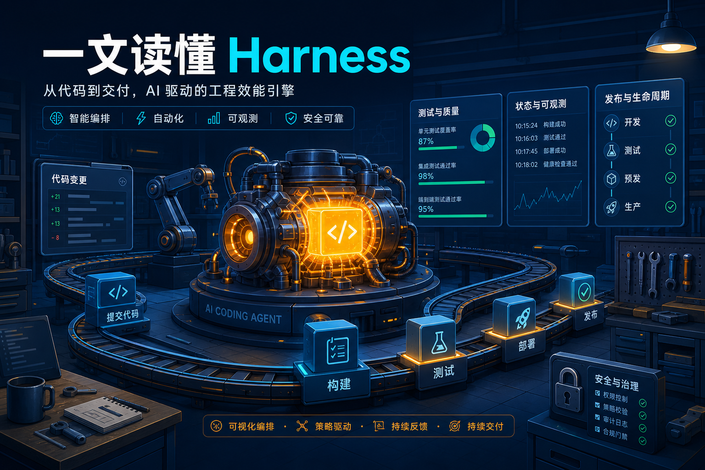
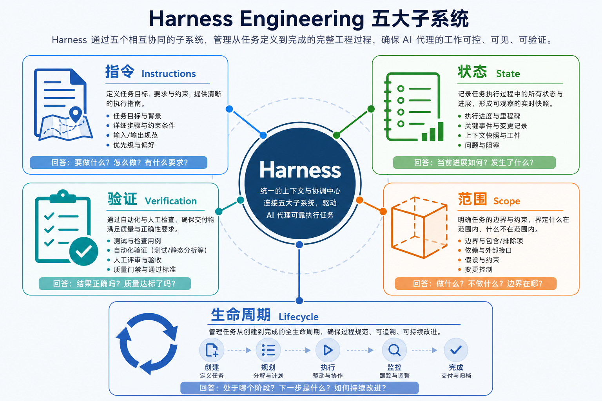
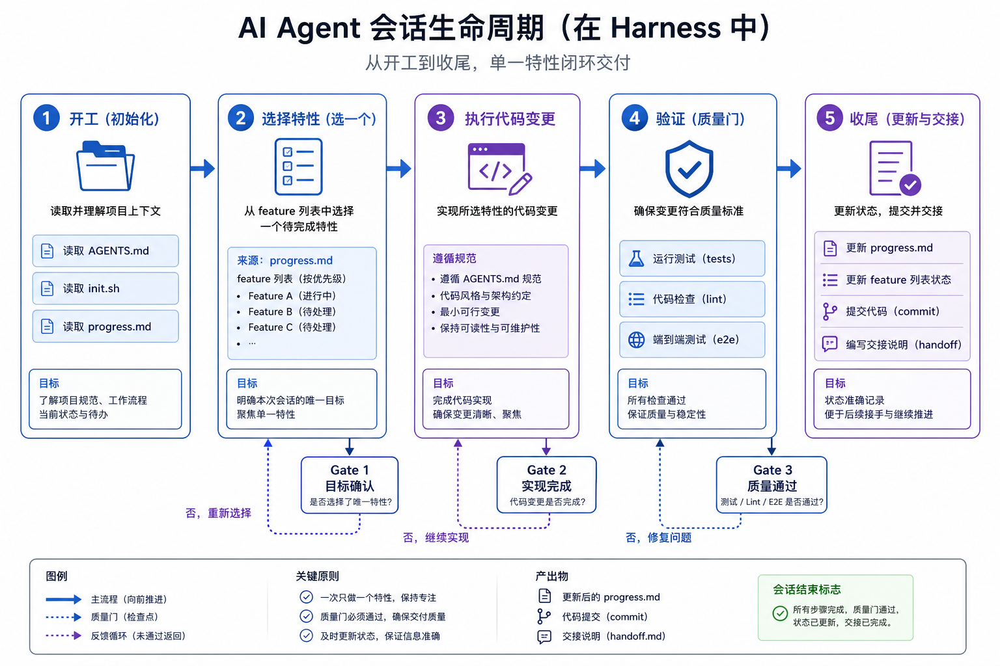

前两天我认真读了一遍 walkinglabs 的 [learn-harness-engineering](https://github.com/walkinglabs/learn-harness-engineering)。

说实话，读之前我以为它会是一门「怎么把 AGENTS.md 写得更好」的课。

读完发现，想窄了。

Harness 不是一份更长的提示词，也不是给 Claude Code、Cursor、Codex 多塞几条规矩。它更像是给 AI 搭一间能干活的车间，图纸放哪，工具怎么用，半成品怎么交接，出厂前怎么质检，都得提前摆好。

模型当然很重要。

但模型再强，裸奔进一个真实仓库，也还是容易翻车。不是因为它不会写代码，而是因为真实工程从来不只是写代码。

以下文章太长不想看，那就直接看结果和课程仓库：

https://github.com/walkinglabs/learn-harness-engineering

# 1. 我们到底在抱怨什么？

如果你用 AI 写过一个稍微复杂点的项目，大概率经历过这种场景。

一开始很爽。

你丢给它一个需求，它读文件、改代码、跑命令，屏幕刷得飞快。十分钟后，一个看起来能跑的东西出来了。

然后你开始试用。

按钮点了没反应。页面状态没刷新。测试没跑全。它说「完成了」，但你一执行完整流程，啪，一个异常甩脸上。

这时候最容易得出的结论是，模型还不够强。

再等等吧，等下一个 Opus，等下一个 GPT，等下一个更大的上下文窗口。

我以前也这么想。

但 learn-harness-engineering 里反复强调的一个判断很刺耳：很多失败不是模型能力问题，而是 harness 问题。

课程里引用了一个很典型的对照实验。同一个模型，同一个任务，让它做一个 2D 复古游戏编辑器。裸跑时，20 分钟花了 9 美元，核心功能没跑起来。加上 planner、generator、evaluator 组成的完整 harness 后，6 小时花了 200 美元，游戏可以正常玩。

这个例子里，模型没变。

变的是它工作的环境。

这就是 Harness Engineering 想解决的事。它不问「怎么让模型更聪明」，它问的是：

AI 写代码时，周围那套工程系统够不够靠谱？

# 2. Harness 到底是什么？

一句话版：

Harness 是围绕 AI agent 搭建的一整套工作环境，用来约束它、接住它、验证它，让它跨会话完成真实工程任务。

别急着把它理解成「提示词工程升级版」。Prompt 是你对模型说的一句话。Context 是你给模型看的材料。Harness 是模型所处的整个车间。

一个最小 harness 至少要回答五个问题：

1. 它开工前该读什么？
2. 它怎么知道上次做到哪？
3. 它一次只能改多大范围？
4. 它凭什么说自己做完了？
5. 它结束时怎么给下一轮留下干净现场？

learn-harness-engineering 把这件事拆成五个子系统。

## 2.1 指令，不是百科全书

很多人第一次给 agent 加规则，会把所有东西都塞进一个超长的 `AGENTS.md`。

项目背景、代码规范、架构原则、测试命令、发布流程、踩坑记录，全写进去。看起来很踏实，实际上很容易把 agent 淹死。

课程里讲了一个很关键的设计，根指令文件应该是路由层，不是百科全书。

也就是：

`AGENTS.md` 告诉 agent 开工顺序和硬规则。

真正详细的产品说明、架构图、质量标准、计划文档，放进 `docs/`，让 agent 按需读取。

这和人干活一样。你不可能让新同事第一天背完整个公司 Confluence。你会先告诉他，项目地图在哪，当前任务在哪，出了问题找哪份文档。

给地图，不给百科。

## 2.2 状态，让 agent 别每次都失忆

AI 会话天然像短期记忆很强、长期记忆很差的同事。

这轮聊得热火朝天，下一轮一开，它又像刚入职。

所以 harness 里必须有状态文件。比如：

- `feature_list.json`，哪些功能没开始、进行中、已通过验证。
- `claude-progress.md`，每轮做了什么、跑过什么验证、还卡在哪。
- `session-handoff.md`，长任务中断时，下一轮应该从哪接。

这些文件不是「写给人看的工作总结」那么简单。

它们是 agent 的外置记忆。

课程里有个数据挺扎心：有进度日志的对照组，12 个功能点全部完成并通过验证；没有日志的基线，只完成了 7 个。重建上下文的时间减少约 78%，隐含缺陷率从 43% 降到 8%。

你看，记忆不是情怀，是生产力。

## 2.3 验证，让「我觉得好了」滚一边去

AI 最大的问题之一，不是不会犯错。

是它犯错以后还挺自信。

它很容易在「单测过了」「编译没报错」「我看起来实现了」之后宣布完成。但真实软件里，能编译和能用，中间隔着一条河。

Harness 里的验证系统，就是把「完成」从模型嘴里拿回来。

`npm test`、`npm run lint`、`npm run build`、端到端测试、冒烟测试、架构边界检查、人工可复现步骤，都应该变成显式命令。

而且要留下证据。

不是「已验证」，而是「运行了什么命令，输出是什么，验证了哪条用户行为」。

课程第十讲里有个例子，5 个组件边界缺陷，单元测试一个都没抓到，端到端测试全抓到了。代价是测试时间从 2 秒增加到 15 秒。

15 秒很贵吗？

跟后面一下午擦屁股比，太便宜了。

## 2.4 范围，一次只端一个盘子

Agent 很容易 overreach。

你让它修一个筛选 Bug，它顺手重构状态管理。你让它加一个按钮，它顺手改了路由、样式、数据层，还热心地「优化」了一堆你没让它碰的东西。

到头来看起来改了很多，真正完成的很少。

课程第七讲把这件事讲得很直白：WIP=1。

一次只做一个功能。

一个功能没有验证通过，不开下一个坑。

这听起来保守，但对 agent 特别重要。课程里引用的对照数据是，「小下一步」策略的任务完成率比宽泛提示高 37%。另一个项目例子里，自助餐模式 8 个功能只完成 3 个，WIP=1 模式完成 7 个。

少做一点，反而多完成一点。

这事儿老程序员都懂。新人最可怕的不是不会写，是太积极。

## 2.5 生命周期，开工和收工都得有规矩

很多 agent 失败，不是在中间写代码时失败，而是在开头和结尾失败。

开头没跑初始化，环境本来就是坏的，它还往上叠新功能。

结尾没清理，进度没更新，临时代码没删，下一轮 agent 进来先考古半小时。

所以 harness 要有会话生命周期。

开工时：

- 读 `AGENTS.md`。
- 跑 `./init.sh`。
- 读进度和功能清单。
- 确认 baseline 是绿的。

收工时：

- 跑完整验证。
- 更新进度。
- 更新功能状态。
- 记录没做完的边界。
- 清掉临时东西。
- 只在可以恢复时 commit。

这套流程看着啰嗦，其实就是软件工程里的老东西。

事务要么提交，要么回滚。

会话也一样。别留半截烂尾楼。

# 3. 为什么说 Harness 不是 Prompt Engineering？

Prompt Engineering 解决的是单次回答质量。

Harness Engineering 解决的是多轮工程可靠性。

这俩不是一层东西。

Prompt 像你跟摄影师说：「帮我拍一张傍晚海边的人像，暖色调，有电影感。」

Context 像你给摄影师一本参考册，里面有样片、场地、模特资料、器材清单。

Harness 则是整间摄影棚。

灯怎么布，器材谁保管，拍完怎么选片，修图怎么验收，客户反馈怎么回流，下次拍摄怎么接着上次的风格来。

你当然还需要 prompt。

但真实项目里，单次 prompt 写得再漂亮，也挡不住会话断片、范围乱飞、测试没跑、状态丢失这些老问题。

Harness 的价值，就是把这些老问题搬到模型外面，用工程手段解决。

这也是我觉得这门课有意思的地方。

它没有神化 AI，也没有贬低 AI。它只是很朴素地承认一件事：agent 是新的工人，但工厂纪律还是要有。

# 4. 这门课怎么教你学 Harness？

learn-harness-engineering 不是单纯讲概念。

它用 12 个讲义和 6 个项目，把同一个知识库桌面应用从弱 harness 一路搭到完整 harness。

这个选择挺妙的。

知识库应用不算玩具。它有本地文档导入、索引、问答、引用、状态栏、桌面端 Electron 架构。复杂度够，但又没有复杂到读者完全进不去。

6 个项目的路线大概是这样：

1. 只写 prompt vs 最小规则，先亲眼看到差别。
2. 重组仓库，让 agent 能读懂产品、架构和交接记录。
3. 引入功能清单和验证门，控制范围，防止虚假完成。
4. 加运行日志和结构边界，让 agent 能定位 bug，不是瞎猜。
5. 拆出 generator、evaluator、planner，让生成和评估分离。
6. 把所有机制合起来，做基准测试、清理扫描和消融实验。

注意，这里每一步都不是「多写文档」。

它关心的是行为有没有变好。

比如 Project 05 不是让你写一份漂亮评分表就完事，而是让 evaluator 真正抓缺陷，让 rubric 和人的判断对齐。课程里甚至提醒，自动 evaluator 开箱即用很弱，可能会发现问题，然后把自己说服到通过。需要 3 到 5 轮校准。

这句话我太喜欢了。

因为这就是现实。

AI 评审不是魔法，也是一个需要 harness 的 agent。

# 5. 最小可用 Harness 怎么搭？

如果现在就想给自己的项目加一点 harness，不用一步到位。

先从四个文件开始。

## 5.1 `AGENTS.md`

写短一点。

它只做三件事：

- 开工流程，先读什么，先跑什么。
- 工作规则，一次做几个功能，哪些文件不能乱碰。
- 完成定义，什么证据才算 done。

根文件不要超过一两百行。详细背景放到 `docs/ARCHITECTURE.md`、`docs/PRODUCT.md`、`docs/QUALITY.md` 之类的专题文档里。

## 5.2 `feature_list.json`

别只写「TODO」。

每个功能至少要有：

- `id`
- `description`
- `status`
- `verification`
- `evidence`
- `dependencies`

最关键的是，状态不能靠嘴改。

只有验证命令跑过、有证据，才允许从 `in_progress` 变成 `passing` 或 `done`。

功能清单不是 backlog，它是 agent 的任务边界。

## 5.3 `init.sh`

给项目一个统一入口。

比如安装依赖、类型检查、测试、构建，全都放进去。

然后在 `AGENTS.md` 里写死一条规矩：

如果 `./init.sh` 一开始就失败，先修 baseline，不要加新功能。

这条很土，但很有用。

坏地基上盖楼，盖得越快越吓人。

## 5.4 `progress.md` 或 `session-handoff.md`

每轮结束前，让 agent 写清楚：

- 本轮目标是什么。
- 改了哪些文件。
- 跑了哪些验证。
- 哪些地方没验证。
- 下一轮最好的第一步是什么。

不要写散文。

写给下一个 agent 看，越具体越好。

「继续优化体验」这种话等于没写。「下一步先运行 `npm test -- qa-service`，如果引用为空，检查 `IndexingService.chunkDocument` 的 >1000 字符路径」才有用。

# 6. 几个容易踩的坑

读 `harness-creator` 的参考资料时，我觉得最有价值的不是模板，而是那些 gotchas。

模板大家都会抄。

坑才是真东西。

## 6.1 把 AGENTS.md 写成巨型小说

根指令文件越长，agent 越容易抓不住重点。

尤其是长上下文里，中间部分很容易被忽略。课程第四讲提到 `Lost in the Middle`，这个现象在 agent 指令里特别常见。

解决办法很简单：根文件做路由，细节放专题文档。

## 6.2 功能清单和进度日志各写各的

`feature_list.json` 写 done，`progress.md` 写还有问题。

这种状态漂移，比没有状态还麻烦。

因为 agent 会挑自己喜欢的那份信。

所以要约定清楚：结构化状态以功能清单为准，进度日志记录叙事和证据。两者每轮一起更新。

## 6.3 只验证局部，不跑完整流程

AI 很爱跑最快的测试。

因为快，也因为容易绿。

但真实 Bug 经常出在组件边界。前端状态、IPC、持久化、索引、引用链路，只跑一个服务层单测看不出来。

所以最少要有一条冒烟路径。哪怕慢一点，也得能证明用户行为真的通了。

## 6.4 让同一个 agent 又写又评

自我评审当然有用，但别迷信。

同一个 agent 很容易替自己的实现找理由。更好的做法是把角色拆开，generator 写，evaluator 按 rubric 挑问题，必要时 planner 先写 sprint contract。

这不是为了显得高级。

是为了减少「我都这么努力了，应该算完成吧」这种人类和 AI 都会有的心理。

## 6.5 结束时不清场

临时代码没删，调试日志没收，文档没更新，测试半红半绿。

这轮看似省了 10 分钟，下轮可能多花 40 分钟。

课程第十二讲里有个对比很狠。没有清洁策略的 12 周项目，到第 12 周构建通过率 68%，测试 61%，启动 60 分钟以上。有清洁策略的项目，构建 97%，测试 95%，启动 9 分钟。

清洁不是洁癖。

清洁是给下一轮留命。

# 7. Harness 真正改变了什么？

我读完这门课以后，最大的感受是，Harness Engineering 把 AI Coding 从「聊天」拉回了「工程」。

以前我们太容易把 agent 当成一个聪明聊天对象。

问它，催它，夸它，骂它。

但真实工程不是靠聊天完成的。真实工程靠的是状态、边界、验证、反馈和交接。

这些东西听起来一点都不性感。

`feature_list.json` 不性感。

`init.sh` 不性感。

`clean-state-checklist.md` 更不性感。

但它们决定了 agent 是在帮你干活，还是在给你制造一堆看起来很努力的烂摊子。

这也是为什么我觉得 Harness 会成为 AI Coding 里的基础能力。

Prompt 会继续重要，模型也会继续变强。但当 agent 真正进入真实仓库，问题就不再是「它能不能写一段代码」。

问题会变成：

它能不能在一个月后接着干？

它能不能知道自己没做完？

它能不能在测试失败时找到根因？

它能不能不把别人的半成品踩烂？

它能不能留下一个下次还能启动的项目？

这些问题，靠更会说话的 prompt 解决不了。

得靠 harness。

# 8. 结尾，别急着追新模型

我不是说模型不重要。

模型当然重要。更强的模型会让很多 harness 设计变简单，甚至让一部分旧约束变得多余。课程里也提到，某些针对 Sonnet 4.5 上下文焦虑的复杂机制，到了更强模型后可以删掉。

这点也很重要。

Harness 不是越复杂越好。

它应该像脚手架。施工时承重，楼盖好后能拆就拆。留下来的，应该是那些真正在保护质量、延续状态、减少返工的结构。

所以如果你现在已经在用 AI Coding，我建议别一上来研究 20 条神奇 prompt。

先问自己几个土问题：

- 我的 agent 开工前知道读什么吗？
- 它知道上次做到哪吗？
- 它一次只做一个清晰功能吗？
- 它完成时有可运行证据吗？
- 它结束时给下一轮留下干净现场吗？

这五个问题答不上来，再强的模型也可能只是跑得更快的野马。

Harness 做的事，就是把缰绳、跑道、检查点和马厩都修好。

听起来不酷。

但工程里很多真正有用的东西，本来就不酷。

能稳定交付，才酷。

---

## 资料来源

- [walkinglabs/learn-harness-engineering](https://github.com/walkinglabs/learn-harness-engineering)
- [Learn Harness Engineering 中文文档](https://walkinglabs.github.io/learn-harness-engineering/zh/)
- [OpenAI: Harness engineering: leveraging Codex in an agent-first world](https://openai.com/index/harness-engineering/)
- [Anthropic: Effective harnesses for long-running agents](https://www.anthropic.com/engineering/effective-harnesses-for-long-running-agents)
- [Anthropic: Harness design for long-running application development](https://www.anthropic.com/engineering/harness-design-long-running-apps)
